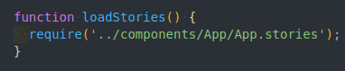
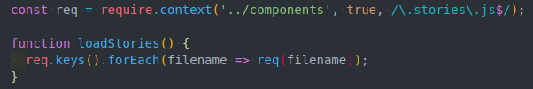
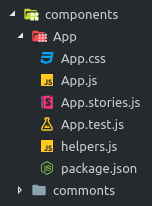

# ReactJS Best Practices

## Content

- Dependencies
- Storybook
- Components Structure
- Links

## Dependencies

### npm -S

```

```

### npm -D

```

```

### npx

```
$ npx -p @storybook/cli sb init
```

## Storybook

### To start

```
$ npm run storybook
```

### To Add

Once we have create a storybook to the component, we need to add it to the loadStories function in the file `./src/stories/stories.js`.



Or we can load all.



## Components Structure

The component should have a css, test, story, helper and package.json(config) files.



## Links

- [ReactJS Best Practices | Scott Bowler](https://www.youtube.com/watch?v=TQ4wW63eoIY)
- [Clean Code vs. Dirty Code: video | Donavon West](https://www.youtube.com/watch?v=f93Abe5w_9A)
- [Clean Code vs. Dirty Code: page | Donavon West](https://americanexpress.io/clean-code-dirty-code/)
- [Our Best Practices for Writing React Components](https://engineering.musefind.com/our-best-practices-for-writing-react-components-dec3eb5c3fc8)
- [ReactJS: Code Reuse Patterns | Guy Romm](https://www.youtube.com/watch?v=0BNgi9vofaw)
- [Storybook](https://storybook.js.org/)
